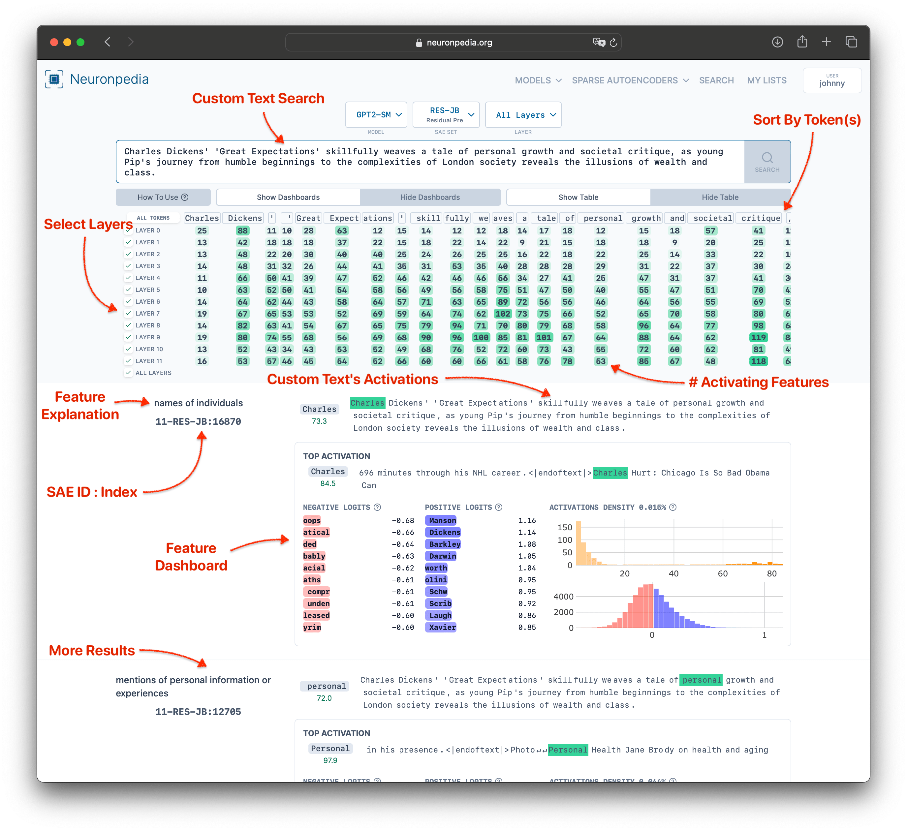
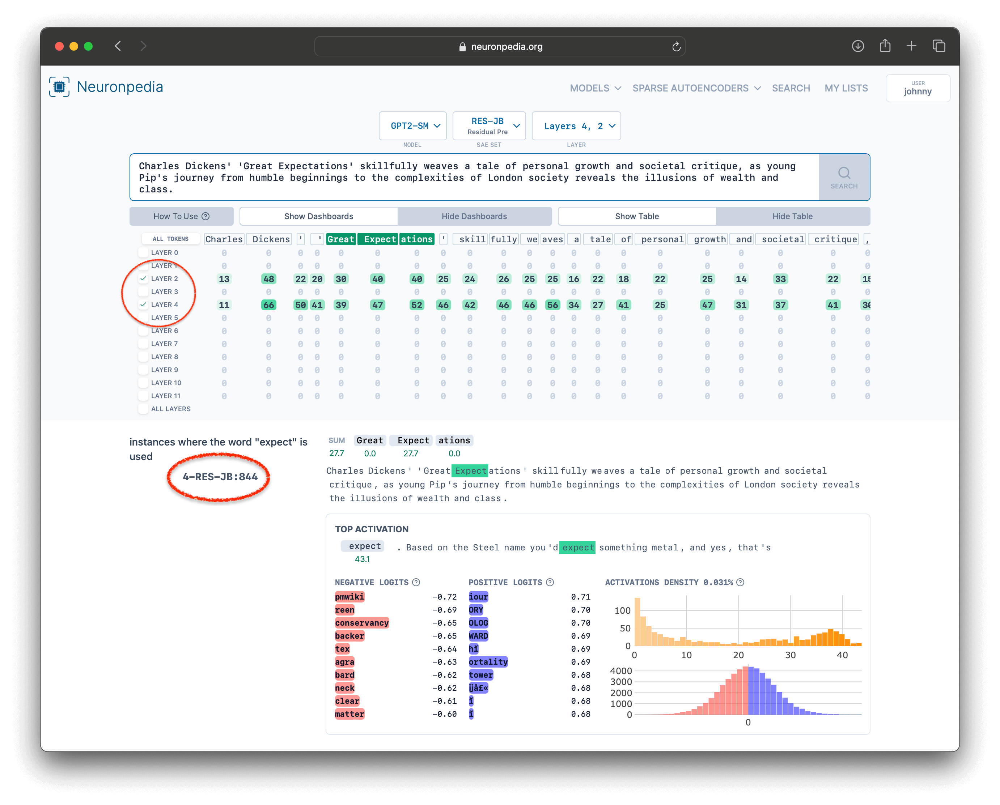
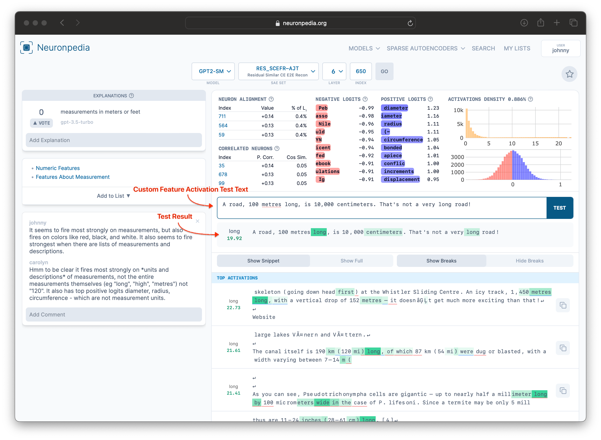

# Search

## What is Search?

Neuronpedia supports **searching** features in multiple ways:

1. **Search by activation** - Run inference on arbitrary text through the model to find features that activate on that text
2. **Search by explanation** - Search for features based on their text explanations

The results show you which features activated most strongly on your input, helping you understand what the model is detecting.

## Search by Activation

When you search by activation, Neuronpedia runs your text through the model and returns the features that activated most strongly.

### Example Search

Here's an [example search](https://www.neuronpedia.org/gpt2-small/?sourceSet=res-jb&selectedLayers=[]&sortIndexes=[]&q=Charles%20Dickens%27%20%27Great%20Expectations%27%20skillfully%20weaves%20a%20tale%20of%20personal%20growth%20and%20societal%20critique%2C%20as%20young%20Pip%27s%20journey%20from%20humble%20beginnings%20to%20the%20complexities%20of%20London%20society%20reveals%20the%20illusions%20of%20wealth%20and%20class.) using the `RES-JB` SAE Set with a sentence about Great Expectations:

`Charles Dickens' 'Great Expectations' skillfully weaves a tale of personal growth and societal critique, as young Pip's journey from humble beginnings to the complexities of London society reveals the illusions of wealth and class.`



### Sort by Specific Tokens

Want to see which features activate most on specific words?

1. **Select tokens** in the results table by clicking them
2. **Click "Reload Search"** to re-sort by those specific tokens

In this example, we selected "Great Expectations" from the search tokens. The results now show features that activate most strongly on those specific words:


### Filter by Layer

To see results from only specific layers:

1. **Check the layer boxes** for the layers you want to include
2. Results will automatically filter to show only features from those layers

Below, we've filtered to only layers 2 and 4, so all results come from `2-RES-JB` or `4-RES-JB`:



## Testing Features with Custom Text

Every feature on Neuronpedia can be tested with your own custom text to see how it activates.

### How to Test

1. Navigate to any feature dashboard
2. Find the "Test Activations" section
3. Enter your custom text
4. View activation strengths on each token

This is useful for:
- Validating your hypotheses about what a feature detects
- Finding edge cases and limitations
- Understanding feature behavior in different contexts

Example: Testing a "Measurement" feature with different types of measurements:



## Share Custom Activation Results

**New in November 2024:** You can now easily share your custom activation tests with others!

### How to Share

When testing a feature with custom text:

1. Enter your custom text and run the test
2. Click the **"↑ Share"** button
3. Copy the generated link
4. Share with colleagues or embed in documentation

### What Gets Shared

The shared link includes:
- The feature being tested
- Your custom activation text
- The activation results

Recipients can:
- View your test results immediately
- Modify the text to run their own tests
- Compare different inputs

### Example Use Case

Instead of sending screenshots of activation tests, you can now send a direct link. For example:

> "Check out how this 'dogs' feature activates on the word 'cats': [link]"

Your colleague clicks the link and sees exactly what you're seeing, with the ability to experiment further.

### Embedding Shared Results

Shared activation results can also be embedded in:
- LessWrong posts (native support)
- Documentation sites
- Research papers (using iframes)

See the [Embedding documentation](embed-iframe) for more details.

## Search by Explanation

**Note:** Requires OpenAI API key configuration for self-hosted instances.

You can search for features based on their text explanations rather than activations:

1. Navigate to the search page
2. Switch to "Search Explanations" mode
3. Enter a concept you're looking for (e.g., "parrots", "breakfast items", "farm animals")
4. Get features whose explanations match your query

### Example: Searching for Parrot Features

```
https://neuronpedia.org/search-explanations/?q=parrots
```

This finds all features that have "parrots" or related concepts in their auto-generated explanations.

### More Examples

From the Llama Scope release (November 2024):
- **Breakfast items**: Find features related to breakfast foods
- **Farm animals**: Find features that detect farm animal concepts
- **Capitalists**: Find features related to capitalism and economic concepts

## Using Search Programmatically

You can access search functionality via the API or Python library:

### Python Library Example

```python
from neuronpedia import NeuronpediaClient

client = NeuronpediaClient()

# Search by activation
results = client.search(
    model="gpt2-small",
    sae_set="res-jb",
    text="Charles Dickens' 'Great Expectations'...",
    top_k=20
)

# Search by explanation
explanation_results = client.search_explanations(
    query="parrots",
    model="gpt2-small"
)
```

### REST API

See the [API documentation](api) or [API sandbox](https://neuronpedia.org/api-doc) for endpoint details.

## Tips for Effective Searching

1. **Use varied text** - Try different phrasings to see how features respond
2. **Filter by layer** - Different layers often capture different abstraction levels
3. **Sort by specific tokens** - Zero in on the exact words you care about
4. **Share your findings** - Use the Share button to collaborate with others
5. **Combine with steering** - Found an interesting feature? Try steering with it!

## Learn More

- [SAE Features](features) - Understanding feature dashboards
- [Steering](steering) - Control model outputs with features
- [Embedding](embed-iframe) - Embed features in your content
- [Case Study: Exploring OpenAI's Latent Directions](https://www.lesswrong.com/posts/QwgYmpnMxBZnmGCsw/exploring-openai-s-latent-directions-tests-observations-and)
